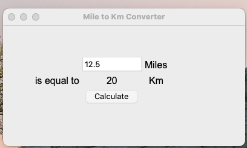

# miles-to-km-tkinter
A Tkinter project to convert miles to Kilometers

## Overview
A simple project for those new to the Python TKinter library. This application is used to convert miles to kilometers. You just need to type in the number of miles and when you hit the calculate button, it should give you the equivalent number of kilometers.

## UI


## To download

```
git clone https://github.com/menonrudhra/miles-to-km-tkinter.git
cd miles-to-km-tkinter
```

## To run the App 

```
python3 main.py
```

